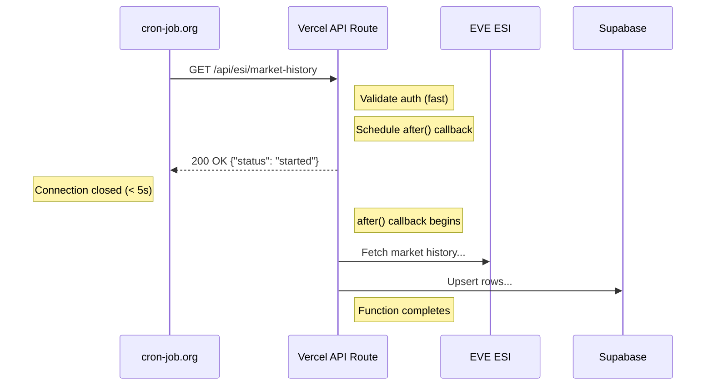

# ESI Proxy API

Proxy endpoints for EVE ESI (EVE Swagger Interface) that require authentication.

## Overview

These endpoints wrap EVE's official ESI API, handling authentication and providing processed responses. All endpoints require a valid EVE SSO access token.

## Background Processing Pattern

Some endpoints (like `/api/esi/market-history`) use Next.js `after()` for background processing. This pattern:

1. Returns an immediate HTTP response (within seconds)
2. Schedules heavy processing to run **after** the response is sent
3. Keeps the Vercel function alive to complete the work

This is essential for external cron services like cron-job.org that have strict timeouts (30 seconds). The actual processing happens in the background and results are logged to Vercel Function logs.

```typescript
import { after } from 'next/server'

export async function GET(request: NextRequest) {
  // Fast validation
  if (!authorized) return NextResponse.json({ error: 'Unauthorized' }, { status: 401 })

  // Schedule background work
  after(async () => {
    await processHeavyWork()  // Runs AFTER response is sent
  })

  // Return immediately
  return NextResponse.json({ status: 'started' })
}
```

## Authentication

All ESI proxy endpoints require the `Authorization` header:

```
Authorization: Bearer <access_token>
```

Obtain access tokens via the [Authentication API](./auth.md).

---

## Endpoints

### GET /api/esi/character-affiliation

Fetches public affiliation info (corporation, alliance) for a character using public ESI endpoints.

**Authentication:** None required (uses public ESI data)

**Query Parameters:**

| Parameter | Type | Required | Description |
|-----------|------|----------|-------------|
| character_id | integer | Yes | EVE character ID to look up |

**Example Request:**
```bash
curl -X GET "http://localhost:3000/api/esi/character-affiliation?character_id=123456789"
```

**Success Response (200):**
```json
{
  "character_id": 123456789,
  "character_name": "Capsuleer Name",
  "corporation_id": 98000001,
  "corporation_name": "Test Corporation",
  "corporation_ticker": "TEST",
  "alliance_id": 99000001,
  "alliance_name": "Test Alliance",
  "alliance_ticker": "ALLY"
}
```

**Response Fields:**

| Field | Type | Description |
|-------|------|-------------|
| character_id | number | The queried character ID |
| character_name | string | Character name from ESI |
| corporation_id | number | Character's corporation ID |
| corporation_name | string | Corporation name |
| corporation_ticker | string | Corporation ticker (e.g., "CORP") |
| alliance_id | number \| null | Alliance ID (null if not in alliance) |
| alliance_name | string \| null | Alliance name (null if not in alliance) |
| alliance_ticker | string \| null | Alliance ticker (null if not in alliance) |

**Error Responses:**

*Missing character_id (400):*
```json
{
  "error": "character_id is required"
}
```

*Character not found (404):*
```json
{
  "error": "Character not found"
}
```

**Implementation Notes:**
- Uses public ESI endpoints (no authentication required)
- Results are cached for 1 hour to reduce ESI calls
- Fetches character info, then corporation info, then alliance info (if applicable)

---

### GET /api/esi/keepstar-3t7

Searches for structures and returns the Keepstar in the specified system.

**Required Scopes:**
- `esi-search.search_structures.v1`
- `esi-universe.read_structures.v1`

**Query Parameters:**

| Parameter | Type | Required | Default | Description |
|-----------|------|----------|---------|-------------|
| search | string | No | "3T7" | Search term (minimum 3 characters) |
| system_name | string | No | "3T7-M8" | System name to search in (e.g., "3T7-M8", "Jita", "1DQ1-A") |

**Example Request:**
```bash
# Search for Keepstar in 3T7-M8 (default)
curl -X GET "http://localhost:3000/api/esi/keepstar-3t7?search=3T7-M8"

# Search for Keepstar in Jita
curl -X GET "http://localhost:3000/api/esi/keepstar-3t7?search=Jita&system_name=Jita"

# Search for Keepstar in 1DQ1-A
curl -X GET "http://localhost:3000/api/esi/keepstar-3t7?search=1DQ&system_name=1DQ1-A"
```

**Success Response (200) - Keepstar Found:**
```json
{
  "structure_id": 1051567430261,
  "name": "3T7-M8 - Goonswarm Keepstar",
  "type_id": 35834,
  "type_name": "Keepstar",
  "solar_system_id": 30002938,
  "solar_system_name": "3T7-M8",
  "owner_id": 1354830081
}
```

**Response - No Keepstar Found:**
```json
{
  "error": "No Keepstar found in 3T7-M8",
  "character_id_used": 123456789,
  "search_term": "3T7",
  "target_system": "3T7-M8",
  "target_system_id": 30002938,
  "hint": "Showing all structures found matching \"3T7\". Looking for type_id=35834 in solar_system_id=30002938. HTTP 401 means no docking access.",
  "expected": {
    "type_id": 35834,
    "solar_system_id": 30002938
  },
  "structures_found": [
    {
      "structure_id": 1051567430261,
      "name": "Some Structure",
      "type_id": 35832,
      "solar_system_id": 30002938
    }
  ]
}
```

**Error Responses:**

*Invalid system name (400):*
```json
{
  "error": "System \"InvalidName\" not found",
  "hint": "Make sure the system name is spelled correctly (e.g., \"Jita\", \"3T7-M8\", \"1DQ1-A\")"
}
```

*Not authenticated (401):*
```json
{
  "error": "Not authenticated. Login with EVE SSO first."
}
```

**Implementation Notes:**
- Searches for structures matching the search term
- Looks up `solar_system_id` from system name using local SDE data (`public/solar-systems.json`)
- Filters results for Keepstars (type_id: 35834) in the specified system
- Returns all found structures if no Keepstar matches criteria
- Requires docking access to see structures in ESI search results

---

### GET /api/esi/structure-orders

Fetches market orders from a player-owned structure and returns the top 5 most expensive items.

**Required Scopes:**
- `esi-markets.structure_markets.v1`

**Query Parameters:**

| Parameter | Type | Required | Default | Description |
|-----------|------|----------|---------|-------------|
| structure_id | integer | Yes | - | The structure ID to fetch orders from |
| buy_orders | boolean | No | false | Set to "true" for buy orders, otherwise returns sell orders |

**Headers:**

| Header | Required | Description |
|--------|----------|-------------|
| Authorization | Yes | Bearer token from EVE SSO |

**Example Request:**
```bash
# Get top 5 most expensive sell orders
curl -X GET "http://localhost:3000/api/esi/structure-orders?structure_id=1051567430261" \
  -H "Authorization: Bearer YOUR_ACCESS_TOKEN"

# Get top 5 most expensive buy orders
curl -X GET "http://localhost:3000/api/esi/structure-orders?structure_id=1051567430261&buy_orders=true" \
  -H "Authorization: Bearer YOUR_ACCESS_TOKEN"
```

**Success Response (200):**
```json
{
  "structure_id": "1051567430261",
  "order_type": "sell",
  "total_orders": 1523,
  "total_pages_fetched": 2,
  "top_5_most_expensive": [
    {
      "rank": 1,
      "order_id": 6741234567,
      "type_id": 23773,
      "type_name": "Molok",
      "price": 450000000000,
      "price_formatted": "450.00B ISK",
      "volume_remain": 1,
      "volume_total": 1,
      "total_value": 450000000000,
      "total_value_formatted": "450.00B ISK",
      "is_buy_order": false,
      "issued": "2024-01-15T10:30:00Z",
      "duration": 90,
      "min_volume": 1,
      "range": "station"
    },
    {
      "rank": 2,
      "order_id": 6741234568,
      "type_id": 42241,
      "type_name": "Vanquisher",
      "price": 380000000000,
      "price_formatted": "380.00B ISK",
      "volume_remain": 1,
      "volume_total": 1,
      "total_value": 380000000000,
      "total_value_formatted": "380.00B ISK",
      "is_buy_order": false,
      "issued": "2024-01-14T15:45:00Z",
      "duration": 90,
      "min_volume": 1,
      "range": "station"
    }
  ],
  "summary": {
    "highest_price": 450000000000,
    "highest_price_formatted": "450.00B ISK",
    "items": ["Molok", "Vanquisher", "Komodo", "Avatar", "Erebus"]
  }
}
```

**Response Fields:**

| Field | Type | Description |
|-------|------|-------------|
| structure_id | string | The queried structure ID |
| order_type | string | "buy" or "sell" |
| total_orders | number | Total orders of this type in the structure |
| total_pages_fetched | number | Number of ESI pages retrieved |
| top_5_most_expensive | array | Top 5 orders by unit price |
| summary | object | Quick summary of results |

**Order Object Fields:**

| Field | Type | Description |
|-------|------|-------------|
| rank | number | Ranking (1-5) |
| order_id | number | Unique order ID |
| type_id | number | EVE type ID of the item |
| type_name | string | Human-readable item name |
| price | number | Price per unit in ISK |
| price_formatted | string | Human-readable price |
| volume_remain | number | Units remaining |
| volume_total | number | Original order quantity |
| total_value | number | price × volume_remain |
| total_value_formatted | string | Human-readable total value |
| is_buy_order | boolean | True for buy orders |
| issued | string | ISO timestamp when order was created |
| duration | number | Order duration in days |
| min_volume | number | Minimum fill quantity |
| range | string | Order range |

**Error Responses:**

*Missing structure_id (400):*
```json
{
  "error": "structure_id is required"
}
```

*Missing authorization (401):*
```json
{
  "error": "Authorization header required. Login with EVE SSO first (requires esi-markets.structure_markets.v1 scope)."
}
```

*ESI Error (various):*
```json
{
  "error": "ESI Error: 403",
  "details": "Forbidden - you don't have docking access to this structure"
}
```

**Implementation Notes:**
- Fetches all pages of market orders (handles ESI pagination)
- Filters by order type (buy/sell) based on query parameter
- Sorts by unit price descending
- Fetches type names from ESI for the top 5 items
- Formats ISK values with appropriate suffixes (K, M, B, T)

---

### GET /api/esi/character-assets

Fetches all assets for the authenticated character, aggregated by item type.

**Required Scopes:**
- `esi-assets.read_assets.v1`

**Query Parameters:**

| Parameter | Type | Required | Default | Description |
|-----------|------|----------|---------|-------------|
| include_blueprints | boolean | No | false | Include blueprint copies in results |

**Headers:**

| Header | Required | Description |
|--------|----------|-------------|
| Authorization | Yes | Bearer token from EVE SSO |

**Example Request:**
```bash
curl -X GET "http://localhost:3000/api/esi/character-assets" \
  -H "Authorization: Bearer YOUR_ACCESS_TOKEN"
```

**Success Response (200):**
```json
{
  "character_id": 123456789,
  "total_unique_types": 245,
  "total_items": 1523,
  "pages_fetched": 2,
  "assets": [
    {
      "type_id": 34,
      "type_name": "Tritanium",
      "total_quantity": 50000000,
      "locations": 3
    },
    {
      "type_id": 35,
      "type_name": "Pyerite",
      "total_quantity": 25000000,
      "locations": 2
    }
  ]
}
```

**Response Fields:**

| Field | Type | Description |
|-------|------|-------------|
| character_id | number | The authenticated character's ID |
| total_unique_types | number | Number of unique item types |
| total_items | number | Total individual asset entries |
| pages_fetched | number | Number of ESI pages retrieved |
| assets | array | Aggregated assets by type |

**Asset Object Fields:**

| Field | Type | Description |
|-------|------|-------------|
| type_id | number | EVE type ID |
| type_name | string | Human-readable item name |
| total_quantity | number | Total quantity across all locations |
| locations | number | Number of unique locations |
| is_blueprint_copy | boolean | True if item is a blueprint copy (only if include_blueprints=true) |

**Error Responses:**

*Missing authorization (401):*
```json
{
  "error": "Authorization header required. Login with EVE SSO first (requires esi-assets.read_assets.v1 scope)."
}
```

*Invalid token (401):*
```json
{
  "error": "Invalid access token - could not extract character ID"
}
```

**Implementation Notes:**
- Fetches all pages of assets from ESI in parallel
- Aggregates assets by type_id, summing quantities
- Resolves type names from local `data/inv-types.json`
- Blueprint copies are excluded by default (set `include_blueprints=true` to include)
- Sorted by total quantity descending

---

## ISK Formatting

The API formats ISK values using these suffixes:

| Suffix | Value | Example |
|--------|-------|---------|
| T | Trillion | 450.00T ISK |
| B | Billion | 1.50B ISK |
| M | Million | 250.00M ISK |
| K | Thousand | 500.00K ISK |
| (none) | Below 1000 | 750.00 ISK |

---

### GET /api/esi/market-history

Fetches historical market statistics for all tradeable items (ships, modules, ammo, boosters) from ESI and stores in Supabase. Supports multiple modes for initial data population and daily updates. Uses chunked processing and **background processing** to handle long-running operations.

**Authentication:** Requires `CRON_SECRET` Bearer token (Vercel cron authentication)

**Query Parameters:**

| Parameter | Type | Required | Default | Description |
|-----------|------|----------|---------|-------------|
| mode | string | No | legacy | Fetch mode: `initial`, `daily`, `backfill`, or `legacy` |
| days | integer | No | 365 | Days to fetch for `initial`/`backfill` modes |
| region_id | integer | No | 10000002 | EVE region ID (The Forge = Jita) |
| chunk | integer | No | - | Which chunk to process (0 to total_chunks-1) |
| total_chunks | integer | No | 24 | Total chunks to split items into |
| limit | integer | No | - | Limit items to process (for testing) |

**Modes:**

| Mode | Description | Use Case | Background? |
|------|-------------|----------|-------------|
| `initial` | Fetch last N days (default 365) | One-time data population | Yes |
| `daily` | Fetch only yesterday's data | Hourly cron jobs (chunked) | Yes |
| `backfill` | Like initial but with chunking | Manual historical data loading | Yes |
| `legacy` | Fetch last 7 days | Original behavior | Yes |
| `verify` | Check if type_ids exist in DB | Debugging (requires `type_ids` param) | No |
| `test_assets` | Fetch specific type_ids only | Testing (requires `type_ids` param) | No |

Note: `verify` and `test_assets` modes are synchronous and return full results in the response.

**Background Processing Pattern:**

This endpoint uses Next.js `after()` to process market history in the background after returning an immediate response. This solves the cron-job.org 30-second timeout limitation:



Key benefits:
- Returns within seconds, avoiding external cron timeouts
- Vercel keeps the function alive to complete background work
- Results logged to Vercel Function logs (search for `[Market History BG]`)

**Chunking (Distributed Cron Jobs):**

Items are split into chunks using deterministic modulo assignment:

```typescript
// Each type_id is assigned to exactly one chunk (no duplicates, no misses)
items = items.filter(item => item.typeId % totalChunks === chunk)
```

This guarantees:
- Each `typeId` always maps to the same chunk (deterministic)
- Every item is processed exactly once per day
- Order-independent - works regardless of source file changes

**Example Requests:**
```bash
# Daily update for chunk 5 of 24 (Jita)
curl -X GET "http://localhost:3000/api/esi/market-history?mode=daily&chunk=5" \
  -H "Authorization: Bearer $CRON_SECRET"

# Daily update for chunk 5 (Vale of the Silent)
curl -X GET "http://localhost:3000/api/esi/market-history?mode=daily&region_id=10000003&chunk=5" \
  -H "Authorization: Bearer $CRON_SECRET"

# Backfill chunk 0 of 100 for past year
curl -X GET "http://localhost:3000/api/esi/market-history?mode=backfill&chunk=0&total_chunks=100" \
  -H "Authorization: Bearer $CRON_SECRET"

# Legacy mode (last 7 days, all items)
curl -X GET "http://localhost:3000/api/esi/market-history?mode=legacy" \
  -H "Authorization: Bearer $CRON_SECRET"
```

**Success Response (200) - Job Started:**

For standard cron modes (daily, initial, backfill, legacy), the endpoint returns immediately with job info:

```json
{
  "status": "started",
  "message": "Processing in background. Check Vercel logs for progress.",
  "job": {
    "mode": "daily",
    "mode_description": "daily (yesterday only, chunk 5/24)",
    "region_id": 10000002,
    "concurrent_requests": 20,
    "date_from": "2025-12-09",
    "date_to": "2025-12-09",
    "chunk": 5,
    "total_chunks": 24,
    "category_filter": null,
    "skip_db": false,
    "save_cache": false,
    "save_report": false
  },
  "note": "Results will be logged. Check Vercel Function logs for \"[Market History BG]\" entries."
}
```

**Response Fields:**

| Field | Type | Description |
|-------|------|-------------|
| status | string | Always "started" for background jobs |
| message | string | Instructions for checking results |
| job.mode | string | The mode used for this fetch |
| job.mode_description | string | Human-readable mode description |
| job.region_id | number | Region ID being processed |
| job.chunk | number | Chunk number (null if not chunked) |
| job.total_chunks | number | Total chunks |
| job.category_filter | array | Category IDs being filtered (null if none) |

**Monitoring Background Jobs:**

Since results are logged (not returned in the response), check Vercel logs:

1. Go to Vercel Dashboard → Your Project → Functions
2. Filter logs for `[Market History BG]`
3. Look for completion messages like:
   ```
   [Market History BG] Complete! mode=daily, region=10000002, chunk=5/24
   [Market History BG] Stats: 189 success, 55 failed, 157 with data, 157 rows inserted, 8620ms total
   ```

**Implementation Notes:**
- Uses `after()` from `next/server` for background processing
- Reads items from `data/tradeable-items.jsonl` (ships, modules, ammo, boosters)
- Fetches ESI market history with 20 concurrent requests
- `initial` mode: Fetches last 365 days for full historical data
- `daily` mode: Fetches only yesterday (single day append - efficient)
- `backfill` mode: Like initial but designed for chunked manual backfill
- Upserts to Supabase `market_history` table (ON CONFLICT replace)
- Failed fetches are normal - many items have no regional market data
- Background work must complete within Vercel function limits (60s Hobby, 300s Pro)

**Cron Jobs (via cron-job.org):**

Since Vercel's free tier only allows 2 cron jobs, we use [cron-job.org](https://cron-job.org) as an external cron service. Jobs are provisioned via API using the setup script.

Items are distributed across 52 cron jobs with 3 regions running at different minute offsets:

| Region | ID | Schedule | Chunks | Items/Chunk |
|--------|-----|----------|--------|-------------|
| The Forge (Jita) | 10000002 | :00 hourly (hours 0-19) | 20 | ~350 |
| Vale of the Silent | 10000003 | :20 hourly (hours 0-19) | 20 | ~350 |
| Deklein | 10000035 | :40 every 2h | 12 | ~583 |
| **Total** | | | **52** | |

**Setup Script:**

```bash
# Set required environment variables in .env.local:
# CRONJOB_API_KEY=your-cron-job-org-api-key
# CRON_SECRET=your-cron-secret
# VERCEL_URL=your-app.vercel.app

# Create all 52 cron jobs
npx tsx scripts/setup-cron-jobs.ts

# List existing jobs
npx tsx scripts/setup-cron-jobs.ts --list

# Delete all jobs and recreate
npx tsx scripts/setup-cron-jobs.ts --delete
```

The script creates jobs that call the market history endpoint with the `Authorization: Bearer <CRON_SECRET>` header.

**Setup Workflow:**
1. Run `?mode=backfill&chunk=N&total_chunks=100` iteratively to populate 365 days of history (Jita & Vale only)
2. Run `npx tsx scripts/setup-cron-jobs.ts` to create all 52 cron jobs on cron-job.org
3. Cron jobs run `?mode=daily&chunk=N` hourly to append yesterday's data
4. All 52 chunks complete daily = full item coverage for all 3 regions
5. Historical data grows over time (no data is deleted)

---

### GET /api/esi/market-history-raw

Debug endpoint to fetch raw market history for a single item in any region directly from ESI. Does NOT store to database - pure ESI debugging tool.

**Authentication:** None required

**Query Parameters:**

| Parameter | Type | Required | Default | Description |
|-----------|------|----------|---------|-------------|
| type_id | integer | Yes | - | EVE type ID of the item |
| region_id | integer | No | 10000002 | EVE region ID |
| days | integer | No | 30 | Number of recent days to return |

**Common Region IDs:**

| Region | ID | Notes |
|--------|-----|-------|
| The Forge | 10000002 | Jita |
| Vale of the Silent | 10000003 | Null-sec (used for demand estimation) |
| Deklein | 10000035 | Null-sec |
| Domain | 10000043 | Amarr |
| Sinq Laison | 10000032 | Dodixie |
| Heimatar | 10000030 | Rens |
| Metropolis | 10000042 | Hek |

**Example Requests:**
```bash
# Tritanium in Jita
curl -X GET "http://localhost:3000/api/esi/market-history-raw?type_id=34"

# Legion subsystem in Vale of the Silent
curl -X GET "http://localhost:3000/api/esi/market-history-raw?type_id=45610&region_id=10000003"

# Last 7 days only
curl -X GET "http://localhost:3000/api/esi/market-history-raw?type_id=34&days=7"
```

**Success Response (200):**
```json
{
  "success": true,
  "type_id": 45610,
  "region_id": 10000003,
  "region_name": "Vale of the Silent",
  "esi_url": "https://esi.evetech.net/markets/10000003/history/?type_id=45610",
  "total_entries_from_esi": 365,
  "entries_in_date_range": 30,
  "date_filter": {
    "days_requested": 30,
    "cutoff_date": "2025-11-12",
    "oldest_in_response": "2025-11-12",
    "newest_in_response": "2025-12-12"
  },
  "summary": {
    "avg_price": 15000000,
    "min_price": 14500000,
    "max_price": 16000000,
    "total_volume": 150,
    "total_orders": 45,
    "avg_daily_volume": 5,
    "days_with_trades": 30
  },
  "data": [
    {
      "date": "2025-12-12",
      "average": 15500000,
      "highest": 16000000,
      "lowest": 15000000,
      "order_count": 3,
      "volume": 5
    }
  ],
  "all_esi_data": {
    "oldest_date": "2024-12-12",
    "newest_date": "2025-12-12",
    "total_entries": 365
  },
  "duration_ms": 245
}
```

**No Data Response:**
```json
{
  "success": false,
  "message": "No market history for this item in this region",
  "type_id": 45610,
  "region_id": 10000003,
  "esi_status": 404,
  "hint": "This item may not be traded in this region, or has no recent trade history",
  "duration_ms": 150
}
```

**Use Cases:**
- Debug why specific items (like subsystems) aren't appearing in market history
- Verify ESI is returning data for a region before running batch imports
- Compare market data between regions (Jita vs Vale of the Silent)

---

### GET /api/esi/market-history-test

Test endpoint to fetch market history for a single item. Useful for validating the integration.

**Authentication:** None required

**Query Parameters:**

| Parameter | Type | Required | Default | Description |
|-----------|------|----------|---------|-------------|
| type_id | integer | No | 34 | EVE type ID (34 = Tritanium) |
| region_id | integer | No | 10000002 | EVE region ID |

**Example Request:**
```bash
# Default: Tritanium
curl -X GET "http://localhost:3000/api/esi/market-history-test"

# Specific item: Rifter
curl -X GET "http://localhost:3000/api/esi/market-history-test?type_id=587"
```

**Success Response (200):**
```json
{
  "success": true,
  "type_id": 34,
  "region_id": 10000002,
  "entries_fetched": 403,
  "entries_stored": 7,
  "date_range": {
    "from": "2025-12-02",
    "to": "2025-12-08"
  },
  "data": [
    {
      "type_id": 34,
      "date": "2025-12-08",
      "average": 3.99,
      "highest": 4.01,
      "lowest": 3.94,
      "order_count": 2106,
      "volume": 7126308159,
      "region_id": 10000002,
      "updated_at": "2025-12-09T12:14:56.461+00:00"
    }
  ],
  "summary": {
    "avg_price": 3.99,
    "total_volume": 43106712580,
    "total_orders": 16878
  }
}
```

**Response Fields:**

| Field | Type | Description |
|-------|------|-------------|
| type_id | number | The queried item type ID |
| region_id | number | The queried region ID |
| entries_fetched | number | Total history entries from ESI |
| entries_stored | number | Entries within last 7 days |
| date_range | object | Start and end dates of stored data |
| data | array | The actual market history entries |
| summary | object | Aggregated statistics |

**Error Response - No Market Data:**
```json
{
  "message": "No market history in the last 7 days for this item",
  "type_id": 12345,
  "region_id": 10000002,
  "total_history_entries": 50,
  "oldest_entry": "2024-01-01",
  "newest_entry": "2024-06-15"
}
```

---

---

### POST /api/sell-opportunities

Analyzes character assets against historical market data to identify optimal sell opportunities. Compares current Jita sell prices to all-time high prices.

**Authentication:** None required (but requires asset data from authenticated endpoint)

**Request Body:**
```json
{
  "assets": [
    { "type_id": 34, "type_name": "Tritanium", "quantity": 1000000 },
    { "type_id": 35, "type_name": "Pyerite", "quantity": 500000 }
  ]
}
```

| Field | Type | Required | Description |
|-------|------|----------|-------------|
| assets | array | Yes | Array of assets to analyze |
| assets[].type_id | number | Yes | EVE type ID |
| assets[].type_name | string | Yes | Item name (used for Janice API lookup) |
| assets[].quantity | number | Yes | Quantity owned |

**Example Request:**
```bash
curl -X POST "http://localhost:3000/api/sell-opportunities" \
  -H "Content-Type: application/json" \
  -d '{"assets":[{"type_id":34,"type_name":"Tritanium","quantity":1000000}]}'
```

**Success Response (200):**
```json
{
  "opportunities": [
    {
      "type_id": 34,
      "type_name": "Tritanium",
      "quantity": 1000000,
      "current_sell_price": 5.85,
      "all_time_high": 6.50,
      "percent_of_ath": 90,
      "total_value": 5850000,
      "recommendation": "sell",
      "recommendation_text": "Good time to sell - near all-time high"
    }
  ],
  "summary": {
    "total_items": 1,
    "sell_now_count": 1,
    "hold_count": 0,
    "wait_count": 0,
    "total_value": 5850000,
    "sell_now_value": 5850000,
    "items_with_ath_data": 1
  }
}
```

**Response Fields:**

| Field | Type | Description |
|-------|------|-------------|
| opportunities | array | Analyzed items sorted by % of ATH (descending) |
| summary.total_items | number | Total items analyzed |
| summary.sell_now_count | number | Items with "sell" recommendation |
| summary.hold_count | number | Items with "hold" recommendation |
| summary.wait_count | number | Items with "wait" recommendation |
| summary.total_value | number | Total ISK value of all items |
| summary.sell_now_value | number | ISK value of items recommended to sell |
| summary.items_with_ath_data | number | Items with historical ATH data |

**Opportunity Object Fields:**

| Field | Type | Description |
|-------|------|-------------|
| type_id | number | EVE type ID |
| type_name | string | Item name |
| quantity | number | Quantity owned |
| current_sell_price | number | Current Jita sell price per unit |
| all_time_high | number | Highest historical price (from market_history) |
| percent_of_ath | number | Current price as percentage of ATH |
| total_value | number | current_sell_price × quantity |
| recommendation | string | "sell", "hold", or "wait" |
| recommendation_text | string | Human-readable recommendation |

**Recommendation Thresholds:**

| Recommendation | % of ATH | Color | Description |
|----------------|----------|-------|-------------|
| sell | >= 80% | Green | Good time to sell |
| hold | 60-79% | Orange | Consider holding |
| wait | < 60% | Red | Wait for better prices |

**Implementation Notes:**
- Queries `market_history` table for MAX(highest) per type_id
- Gets current Jita sell prices via Janice API
- Items without historical data show 100% if they have a current price
- Results sorted by percent_of_ath descending (best opportunities first)

---

### GET /api/esi/wallet

Fetches character wallet balance from ESI.

**Authentication:** Required (EVE SSO Bearer token)

**Required Scope:** `esi-wallet.read_character_wallet.v1`

**Query Parameters:**

| Parameter | Type | Required | Description |
|-----------|------|----------|-------------|
| character_id | integer | Yes | Character ID |

**Headers:**

| Header | Required | Description |
|--------|----------|-------------|
| Authorization | Yes | Bearer token from EVE SSO |

**Example Request:**
```bash
curl -X GET "http://localhost:3000/api/esi/wallet?character_id=12345678" \
  -H "Authorization: Bearer YOUR_ACCESS_TOKEN"
```

**Success Response (200):**
```json
{
  "character_id": "12345678",
  "balance": 1234567890.50,
  "balance_formatted": "1.23B ISK"
}
```

**Response Fields:**

| Field | Type | Description |
|-------|------|-------------|
| character_id | string | The queried character ID |
| balance | number | Raw ISK balance |
| balance_formatted | string | Human-readable balance with suffix |

---

### GET /api/esi/character-orders

Fetches character market orders from ESI with aggregated statistics.

**Authentication:** Required (EVE SSO Bearer token)

**Required Scope:** `esi-markets.read_character_orders.v1`

**Query Parameters:**

| Parameter | Type | Required | Description |
|-----------|------|----------|-------------|
| character_id | integer | Yes | Character ID |

**Headers:**

| Header | Required | Description |
|--------|----------|-------------|
| Authorization | Yes | Bearer token from EVE SSO |

**Example Request:**
```bash
curl -X GET "http://localhost:3000/api/esi/character-orders?character_id=12345678" \
  -H "Authorization: Bearer YOUR_ACCESS_TOKEN"
```

**Success Response (200):**
```json
{
  "character_id": "12345678",
  "total_orders": 25,
  "sell_orders": {
    "count": 20,
    "total_value": 5000000000,
    "total_value_formatted": "5.00B ISK"
  },
  "buy_orders": {
    "count": 5,
    "total_escrow": 100000000,
    "total_escrow_formatted": "100.00M ISK"
  },
  "orders": [
    {
      "order_id": 123456,
      "type_id": 587,
      "is_buy_order": false,
      "price": 1500000,
      "price_formatted": "1.50M ISK",
      "volume_remain": 10,
      "volume_total": 50,
      "location_id": 60003760,
      "issued": "2025-12-01T12:00:00Z",
      "duration": 90
    }
  ]
}
```

**Response Fields:**

| Field | Type | Description |
|-------|------|-------------|
| character_id | string | The queried character ID |
| total_orders | number | Total active market orders |
| sell_orders.count | number | Number of sell orders |
| sell_orders.total_value | number | Total value of items for sale |
| buy_orders.count | number | Number of buy orders |
| buy_orders.total_escrow | number | Total ISK in escrow |
| orders | array | Individual order details |

---

### GET /api/esi/undercut-check

Checks for competitors undercutting your sell orders in a structure and provides copy-pasteable prices to beat them.

**Authentication:** Required (EVE SSO Bearer token)

**Required Scopes:**
- `esi-markets.read_character_orders.v1`
- `esi-markets.structure_markets.v1`

**Query Parameters:**

| Parameter | Type | Required | Default | Description |
|-----------|------|----------|---------|-------------|
| character_id | string | Yes | - | Your character ID |
| structure_id | string | No | 1051567430261 | Structure ID (default: 3T7-M8 Keepstar) |

**Headers:**

| Header | Required | Description |
|--------|----------|-------------|
| Authorization | Yes | Bearer token from EVE SSO |

**Example Request:**
```bash
curl -X GET "http://localhost:3000/api/esi/undercut-check?character_id=12345678&structure_id=1051567430261" \
  -H "Authorization: Bearer YOUR_ACCESS_TOKEN"
```

**Success Response (200):**
```json
{
  "undercut_items": [
    {
      "type_id": 2048,
      "type_name": "Damage Control II",
      "your_order_id": 6741234567,
      "your_price": 500000,
      "your_price_formatted": "500.00K ISK",
      "your_volume_remain": 50,
      "competitor_price": 495000,
      "competitor_price_formatted": "495.00K ISK",
      "competitor_order_id": 6741234568,
      "undercut_price": 494900,
      "undercut_price_formatted": "494.90K ISK",
      "undercut_price_eve": "494,900.00",
      "price_difference": 5000,
      "price_difference_formatted": "5.00K ISK",
      "tick_size": 100
    }
  ],
  "safe_items": [
    {
      "type_id": 3170,
      "type_name": "Medium Shield Extender II",
      "your_order_id": 6741234569,
      "your_price": 750000,
      "your_price_formatted": "750.00K ISK",
      "your_volume_remain": 25,
      "next_competitor_price": 800000,
      "next_competitor_price_formatted": "800.00K ISK"
    }
  ],
  "summary": {
    "undercut_count": 1,
    "safe_count": 1,
    "total_orders_in_structure": 2,
    "structure_id": "1051567430261",
    "total_structure_orders": 1523
  },
  "timing": {
    "total_ms": 2500
  }
}
```

**Response Fields:**

| Field | Type | Description |
|-------|------|-------------|
| undercut_items | array | Orders where competitors have lower prices |
| safe_items | array | Orders where you have the lowest price |
| summary.undercut_count | number | Count of undercut orders |
| summary.safe_count | number | Count of orders with lowest price |
| summary.total_orders_in_structure | number | Your total sell orders in the structure |

**Undercut Item Fields:**

| Field | Type | Description |
|-------|------|-------------|
| type_id | number | EVE type ID |
| type_name | string | Item name |
| your_price | number | Your current price |
| competitor_price | number | Lowest competitor price |
| undercut_price | number | Calculated 1-tick undercut price |
| undercut_price_eve | string | Copy-pasteable format for EVE (e.g., "494,900.00") |
| tick_size | number | The tick size for this price level |

**Tick Size Calculation:**

EVE Online uses 4 significant figures for price precision:
- `tick_size = 10^(floor(log10(price)) - 3)`
- Minimum tick is 0.01 ISK

Examples:
- 500,000 ISK → tick = 100 ISK → undercut = 494,900 ISK
- 5,000,000 ISK → tick = 1,000 ISK → undercut = 4,999,000 ISK
- 50,000,000 ISK → tick = 10,000 ISK → undercut = 49,990,000 ISK

---

### GET /api/esi/capital-efficiency

Analyzes capital efficiency of your active sell orders by calculating estimated days to sell based on regional market volume data.

**Authentication:** Required (EVE SSO Bearer token)

**Required Scopes:**
- `esi-markets.read_character_orders.v1` - To read your character's market orders

**Query Parameters:**

| Parameter | Type | Required | Default | Description |
|-----------|------|----------|---------|-------------|
| transport_cost | number | No | 450 | Transport cost per m³ (ISK) |
| volume_region_id | integer | No | 10000003 | Region ID for volume/demand data |

**Supported Volume Regions:**

| Region | ID | Description |
|--------|-----|-------------|
| Vale of the Silent | 10000003 | Default - Null-sec alliance territory |
| Deklein | 10000035 | Null-sec (Goonswarm) |
| The Forge | 10000002 | High-sec trade hub (Jita) |

**Headers:**

| Header | Required | Description |
|--------|----------|-------------|
| Authorization | Yes | Bearer token from EVE SSO |

**Example Request:**
```bash
curl -X GET "http://localhost:3000/api/esi/capital-efficiency?volume_region_id=10000035" \
  -H "Authorization: Bearer YOUR_ACCESS_TOKEN"
```

**Success Response (200):**
```json
{
  "success": true,
  "characterId": 123456789,
  "analyzedAt": "2025-12-11T12:00:00Z",
  "summary": {
    "totalCapitalDeployed": 5000000000,
    "totalOrders": 50,
    "totalDailyRevenue": 100000000,
    "avgDaysToSell": 25.5,
    "effectiveAPY": 45.2,
    "deadCapitalThreshold": 90,
    "deadCapitalValue": 500000000,
    "deadCapitalOrders": 5,
    "fastCapital": 2000000000,
    "moderateCapital": 1500000000,
    "slowCapital": 1000000000
  },
  "orders": [...],
  "config": {
    "hubFactor": 0.05,
    "transportCostPerM3": 450,
    "deadCapitalThresholdDays": 90
  }
}
```

**Efficiency Categories:**

| Category | Days to Sell | Description |
|----------|--------------|-------------|
| Fast | ≤ 14 days | Quick turnover |
| Moderate | 15-30 days | Normal cycle |
| Slow | 31-90 days | Consider price reduction |
| Dead | > 90 days | Capital stuck, action needed |

---

### GET /api/esi/sell-order-generator

Generates optimal sell prices for character assets in a structure. Uses tiered markup for items with no competition and 1-tick undercut for items with competition. Items that already have existing sell orders are excluded from results.

**Authentication:** Required (EVE SSO Bearer token)

**Required Scopes:**
- `esi-assets.read_assets.v1` - To read your character's assets
- `esi-markets.read_character_orders.v1` - To check your existing sell orders
- `esi-markets.structure_markets.v1` - To read structure market orders

**Query Parameters:**

| Parameter | Type | Required | Default | Description |
|-----------|------|----------|---------|-------------|
| structure_id | string | No | 1051567430261 | Structure ID (default: 3T7-M8 Keepstar) |

**Headers:**

| Header | Required | Description |
|--------|----------|-------------|
| Authorization | Yes | Bearer token from EVE SSO |

**Example Request:**
```bash
curl -X GET "http://localhost:3000/api/esi/sell-order-generator?structure_id=1051567430261" \
  -H "Authorization: Bearer YOUR_ACCESS_TOKEN"
```

**Success Response (200):**
```json
{
  "items": [
    {
      "type_id": 2048,
      "type_name": "Damage Control II",
      "quantity": 50,
      "characters": [
        { "id": 123456789, "name": "Main Character" },
        { "id": 987654321, "name": "Alt Character" }
      ],
      "has_competition": false,
      "jita_price": 450000,
      "jita_price_formatted": "450.00K ISK",
      "competitor_price": null,
      "competitor_price_formatted": null,
      "sell_price": 1800000,
      "sell_price_formatted": "1.80M ISK",
      "sell_price_eve": "1,800,000.00",
      "vale_daily_volume": 2500,
      "estimated_daily_sales": 125,
      "isk_per_day": 225000000,
      "isk_per_day_formatted": "225.00M ISK"
    }
  ],
  "summary": {
    "total_items": 45,
    "total_with_competition": 12,
    "total_no_competition": 33,
    "total_isk_per_day": 500000000,
    "total_isk_per_day_formatted": "500.00M ISK"
  },
  "timing": {
    "total_ms": 3500
  }
}
```

**Response Fields:**

| Field | Type | Description |
|-------|------|-------------|
| items | array | Array of sell order recommendations, sorted by isk_per_day descending |
| summary.total_items | number | Total items with price data |
| summary.total_with_competition | number | Items with existing sell orders |
| summary.total_no_competition | number | Items with no existing sell orders |
| summary.total_isk_per_day | number | Estimated total daily profit |
| summary.filtered_out_existing_orders | number | Items excluded because you have sell orders |

**Item Fields:**

| Field | Type | Description |
|-------|------|-------------|
| type_id | number | EVE type ID |
| type_name | string | Item name |
| quantity | number | Quantity in inventory at the structure |
| characters | array | Characters that have this item: `[{ id: number, name: string }]` |
| has_competition | boolean | Whether there are existing sell orders |
| jita_price | number | Current Jita sell price |
| sell_price | number | Recommended sell price |
| sell_price_eve | string | Copy-pasteable format for EVE (e.g., "1,800,000.00") |
| vale_daily_volume | number | Average daily volume in Vale of the Silent |
| estimated_daily_sales | number | Vale volume × 5% hub factor |
| isk_per_day | number | estimated_daily_sales × (sell_price - jita_price) — daily profit potential |

**Pricing Logic:**

No Competition (Tiered Markup based on Jita price):
- < 500K ISK: 4.0x markup (~300% margin)
- < 2M ISK: 3.0x markup (~200% margin)
- < 10M ISK: 2.0x markup (~100% margin)
- < 50M ISK: 1.7x markup (~70% margin)
- >= 50M ISK: 1.4x markup (~40% margin)

With Competition:
- Price = Lowest competitor price - 1 tick (respects EVE's 4 significant figure precision)

---

### POST /api/esi/ui/open-market-window

Opens the market details window for a specific item type in the EVE Online client.

**Authentication:** Required (EVE SSO Bearer token)

**Required Scopes:**
- `esi-ui.open_window.v1` - To open UI windows in the EVE client

**Query Parameters:**

| Parameter | Type | Required | Description |
|-----------|------|----------|-------------|
| type_id | integer | Yes | The item type ID to open in the market window |
| character_id | integer | No | The character ID to open the window for. If provided, uses that character's token (opens in their EVE client). If not provided, uses the main character's token. |

**Headers:**

| Header | Required | Description |
|--------|----------|-------------|
| Authorization | Yes | Bearer token from EVE SSO |

**Example Request:**
```bash
# Open market window on main character
curl -X POST "http://localhost:3000/api/esi/ui/open-market-window?type_id=2048" \
  -H "Authorization: Bearer YOUR_ACCESS_TOKEN"

# Open market window on a specific character
curl -X POST "http://localhost:3000/api/esi/ui/open-market-window?type_id=2048&character_id=12345678" \
  -H "Authorization: Bearer YOUR_ACCESS_TOKEN"
```

**Success Response (200):**
```json
{
  "success": true,
  "type_id": 2048,
  "character_id": 12345678
}
```

**Error Responses:**

| Status | Description |
|--------|-------------|
| 400 | Missing type_id parameter |
| 401 | Missing or expired authorization token |
| 403 | Token missing `esi-ui.open_window.v1` scope |
| 420 | Rate limited (UI endpoints are limited to 900 requests per 15 minutes) |
| 500 | Internal server error |

**Notes:**
- This endpoint is called automatically when copying undercut prices
- When `character_id` is provided, the market window opens in the EVE client logged into that character
- The EVE client must be running for the window to open
- Part of the ESI UI rate limit group (900 requests / 15 minutes)

---

## Related Files

- `app/api/esi/character-affiliation/route.ts` - Character corporation/alliance lookup
- `app/api/esi/keepstar-3t7/route.ts` - Keepstar search implementation
- `app/api/esi/structure-orders/route.ts` - Structure orders implementation
- `app/api/esi/character-assets/route.ts` - Character assets implementation
- `app/api/esi/wallet/route.ts` - Character wallet balance
- `app/api/esi/character-orders/route.ts` - Character market orders
- `app/api/esi/undercut-check/route.ts` - Undercut tracker implementation
- `app/api/esi/sell-order-generator/route.ts` - Sell order generator implementation
- `app/api/esi/ui/open-market-window/route.ts` - Open market window in EVE client
- `app/api/sell-opportunities/route.ts` - Sell opportunities analysis
- `app/api/esi/market-history/route.ts` - Market history batch implementation
- `app/api/esi/market-history-test/route.ts` - Market history test implementation
- `app/api/esi/market-history-raw/route.ts` - Raw market history debug endpoint
- `lib/market-analysis.ts` - Market analysis utilities including tick size calculations
- `lib/market-seeder.ts` - Market seeder utilities including tiered markup pricing
- `data/tradeable-items.jsonl` - Source file for tradeable items
- `vercel.json` - Cron job configuration

## See Also

- [EVE ESI Documentation](https://esi.evetech.net/ui/)
- [EVE Developers Portal](https://developers.eveonline.com/)

