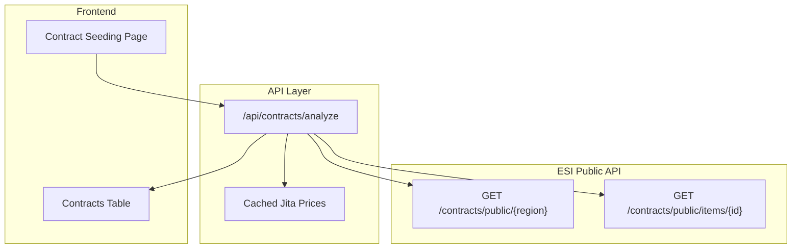

# Contract Seeding Page

The Contract Seeding page helps identify profitable public contracts to flip - where the Jita market value of the items exceeds the contract price.

## Overview

**Path:** `/contracts`

**Purpose:** Analyze public contracts to find opportunities where you can buy a contract for less than the Jita value of its items.

## Features

- **Region Selection** - Analyze contracts in major trade hub regions (Jita, Amarr, Dodixie, Rens, Hek)
- **Real-time Analysis** - SSE progress tracking during contract analysis
- **Profit Calculations** - Automatic comparison of contract price vs Jita item values
- **Sortable Results** - Sort by margin, profit, price, or item count
- **Expandable Details** - View full item breakdown for each contract

---

## How It Works

### Data Flow



### Profit Calculation

For each contract, the system calculates:

```
total_jita_value = Σ (item.quantity × jita_sell_price[item.type_id])
profit = total_jita_value - contract_price
profit_margin = (profit / contract_price) × 100
```

A contract is **profitable** if:
- `profit >= min_profit` (default: 1,000,000 ISK)
- `profit_margin >= min_margin` (default: 5%)

### Contract Filtering

The analysis filters contracts by:

| Filter | Description |
|--------|-------------|
| Type | Only `item_exchange` contracts (auctions optional) |
| Price | Must have a positive price |
| Items | Must have items with Jita price data |
| Validity | Must not be expired |

---

## Summary Cards

| Card | Description |
|------|-------------|
| Total Analyzed | Number of contracts analyzed (capped at 500) |
| Profitable | Contracts meeting profit/margin thresholds |
| Avg Margin | Average profit margin of profitable contracts |
| Total Profit | Sum of potential profit from all opportunities |

---

## Results Table

The table displays profitable contracts with sortable columns:

| Column | Description | Sortable |
|--------|-------------|----------|
| Margin | Profit margin percentage | Yes |
| Profit | ISK profit (Jita value - contract price) | Yes |
| Price | Contract purchase price | Yes |
| Items | Number of unique item types (and total units) | Yes |
| Expires | Time until contract expires | No |

Click a row to expand and see:
- Contract ID (with copy button)
- Issue date and expiry
- Volume in m³
- Pricing breakdown (Contract Price / Jita Value / Your Profit)
- Full item list with quantities and values

---

## API Endpoint

### GET /api/contracts/analyze

Analyzes public contracts in a region for profit opportunities.

#### Query Parameters

| Parameter | Type | Required | Default | Description |
|-----------|------|----------|---------|-------------|
| region_id | number | No | 10000002 | Region ID (The Forge) |
| min_profit | number | No | 1000000 | Minimum profit in ISK |
| min_margin | number | No | 5 | Minimum margin percentage |
| max_contract_price | number | No | null | Maximum contract price |
| include_auctions | boolean | No | false | Include auction contracts |
| stream | boolean | No | false | Use SSE for progress updates |

#### Response

```json
{
  "success": true,
  "generated_at": "2025-12-31T12:00:00Z",
  "region_id": 10000002,
  "region_name": "The Forge",
  "summary": {
    "total_contracts_fetched": 1500,
    "item_exchange_contracts": 800,
    "contracts_analyzed": 500,
    "profitable_contracts": 45,
    "avg_profit_margin": 18.5,
    "total_potential_profit": 1500000000
  },
  "opportunities": [
    {
      "contract_id": 123456789,
      "type": "item_exchange",
      "title": "Cheap Ships!",
      "contract_price": 50000000,
      "total_jita_value": 75000000,
      "profit": 25000000,
      "profit_margin": 50.0,
      "issuer_id": 12345678,
      "issuer_corporation_id": 98765432,
      "for_corporation": false,
      "date_issued": "2025-12-30T10:00:00Z",
      "date_expired": "2026-01-13T10:00:00Z",
      "volume": 5000,
      "start_location_id": 60003760,
      "items": [
        {
          "type_id": 24690,
          "type_name": "Rifter",
          "quantity": 10,
          "is_included": true,
          "jita_buy_price": 7500000,
          "total_jita_value": 75000000
        }
      ],
      "item_count": 1,
      "total_quantity": 10,
      "items_priced": 1,
      "items_missing_price": 0
    }
  ],
  "config": {
    "min_profit": 1000000,
    "min_margin": 5,
    "max_contract_price": null,
    "include_auctions": false
  },
  "timing": {
    "contracts_fetch_ms": 1200,
    "items_fetch_ms": 15000,
    "jita_prices_ms": 3000,
    "analysis_ms": 500,
    "total_ms": 19700
  }
}
```

---

## SSE Progress Events

When using `stream=true`, the API sends Server-Sent Events:

| Stage | Description |
|-------|-------------|
| connecting | Initial connection |
| contracts | Fetching public contracts from ESI |
| items | Fetching items for each contract |
| prices | Fetching Jita prices for items |
| analyzing | Calculating profit metrics |
| complete | Analysis finished |
| error | Error occurred |

---

## Region Support

| Region | ID | Trade Hub |
|--------|----|-----------| 
| The Forge | 10000002 | Jita 4-4 |
| Domain | 10000043 | Amarr |
| Sinq Laison | 10000032 | Dodixie |
| Heimatar | 10000030 | Rens |
| Metropolis | 10000042 | Hek |

---

## Requirements

### Authentication

Requires EVE SSO login (account must be approved). No ESI scopes required - uses public ESI endpoints only.

### Rate Limiting

Standard rate limiting applies based on user role.

---

## Usage Flow

1. **Login with EVE SSO** if not already authenticated
2. **Select a Region** from the dropdown (default: Jita/The Forge)
3. **Click "Analyze Contracts"** to start the analysis
4. **Watch the Progress Bar** as contracts are fetched and analyzed
5. **Review Results** in the sortable table
6. **Click a Row** to expand and see full item details
7. **Find the Contract** in-game using the contract ID
8. **Buy and Resell** the items in Jita for profit

---

## Performance

| Scenario | Typical Time |
|----------|--------------|
| Contract fetch | 1-3 seconds |
| Item fetch (500 contracts) | 10-20 seconds |
| Price lookup | 2-5 seconds |
| Total analysis | 15-30 seconds |

The main bottleneck is fetching items for each contract (one ESI call per contract).

---

## Limitations

- **Maximum 500 contracts** analyzed per request (for performance)
- **Blueprint copies** are included but may not price accurately
- **Item stacks with no Jita data** are skipped in value calculation
- **Location not shown** - you'll need to find the contract in-game

---

## Related

- [Market Seeder](./market-seeder.md) - Find items to import from Jita
- [ESI API](../api/esi.md) - ESI integration documentation

---

## Component Architecture

### Files

```
app/(authenticated)/contracts/
└── page.tsx                    # Main page component

components/contracts/
├── index.ts                    # Barrel exports
└── contracts-table.tsx         # Sortable results table

app/api/contracts/
└── analyze/
    └── route.ts                # Analysis API endpoint

types/
└── contracts.ts                # TypeScript interfaces
```

### State Management

All state is managed in the page component:
- Region selection
- Loading/error states
- Analysis results
- SSE progress tracking

